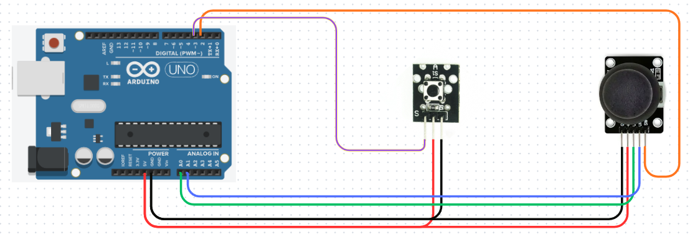
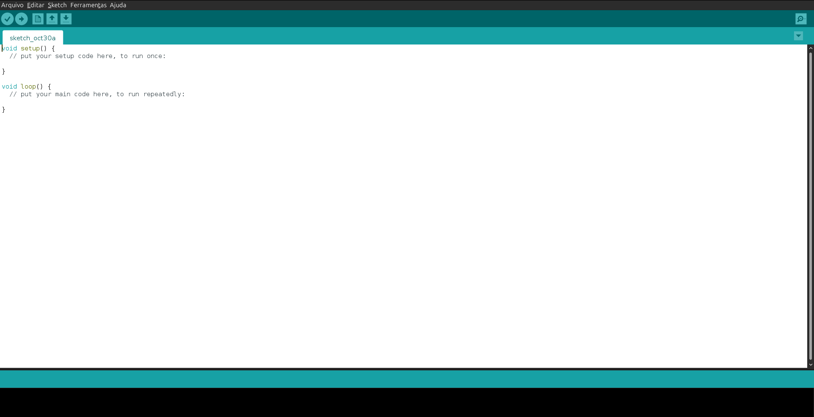
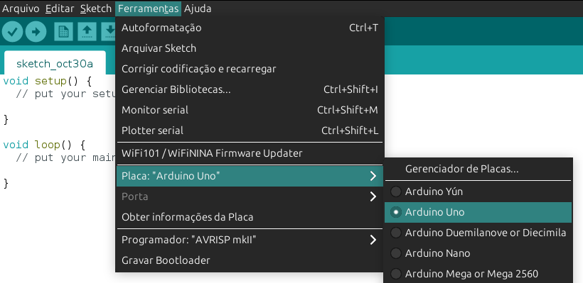
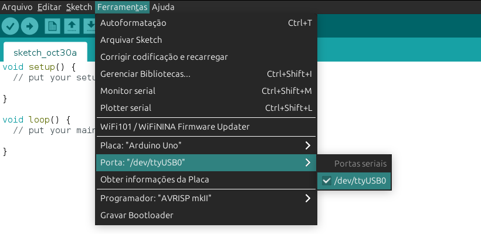
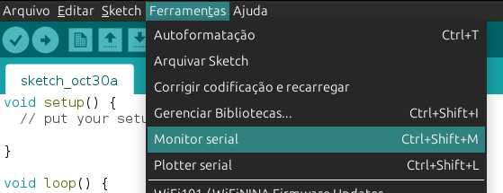
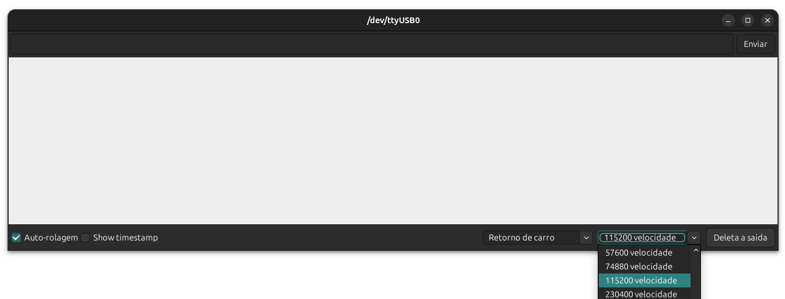

## Componentes
Para o projeto são necessários:

1. Arduino Uno ou Mega.
2. Cabo de dados.
2. Módulo Joystick.
3. Módulo de Botão.
4. Jumpers de conexão.
5. Protoboard _(opcional)_.

## Conexões físicas
Esquema de ligações

    

Siga os passos abaixo para conectar todos os fios nas portas corretas:

> ⚠️ **Atenção:**  Mantenha o Arduino desconectado/desligado durante o processo.

### Módulo de Botão 🔘
- 
Conecte o pino "S" do módulo, com a porta digital 3

- 
Conecte o pino central do módulo, com a porta digital 5v

- 
Conecte o pino central do módulo, com a porta digital GND

### Módulo de Joystick 🕹️
- 
Conecte o pino "GND" do módulo, com a porta digital GND

- 
Conecte o pino "+5v" do módulo, com a porta digital 5v

- 
Conecte o pino "VRx" do módulo, com a porta analógica A0

- 
Conecte o pino "VRy" do módulo, com a porta analógica A1

- 
Conecte o pino "SW" do módulo, com a porta digital 2

## Conectando com o Arduino IDE
Usaremos o software Arduino IDE para programação.

👉 [**Baixe o Arduino IDE aqui**](https://www.arduino.cc/en/software)

### Configurando ambiente
Após iniciar o  software, você verá o ambiente de trabalho:

    

Conecte o Arduino a uma porta USB.

#### Placa
No menu "Ferramentas", clique em "placa" e selecione: "Arduino Uno"

    

#### Porta
No mesmo menu, clique em "Porta" e selecione a porta disponível

    

#### Monitor Serial
No mesmo menu, clique em "Monitor Serial". 

    

Uma nova janela abrirá. Este é o monitor serial, usaremos ele para observar as saídas do programa.

No canto inferior direito, clique na caixa e escolha _"115200 velocidade"_.

    

Esta é a velocidade que a nossa porta serial estará usando para comunicação. É essencial fazer este passo para que não ocorram erros de exibição dos dados.

## Movimentação na tela
O [Emulador de Joystick](https://github.com/VitorRibe/joystick_secomp/blob/main/joystick_emulador.py)
recebe os dados do Arduino e decide qual dos comandos de teclado abaixo enviar para o computador:

### joystick 🕹️
- **Seta para cima ⬆️** = _quando pressionado joystick para cima_
- **Seta para baixo ⬇️** = _quando pressionado joystick para baixo_
- **Seta para esquerda ⬅️** = _quando pressionado joystick para esquerda_
- **Seta para direita ➡️** = _quando pressionado joystick para direita_

### botões 🔘
- **letra z** = _quando pressionado botão da direita_
- **letra x** = _quando pressionado botão da esquerda_

<footer style="border-top: 1px solid #ccc; padding-top: 10px;">
  

     
    
    
     
    Projeto desenvolvido pelos membros discentes em Ciência da Computação da empresa júnior Prototipe Jr. 
     
  

</footer>
